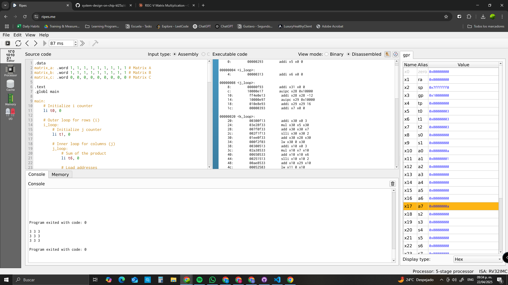

# Matrix Multiplication in RISC-V Assembly

## Overview

This repository contains a RISC-V assembly implementation of matrix multiplication for 3×3 matrices. The program calculates the product of two matrices A and B, storing the result in matrix C, and then displays the result.

## Implementation Details

The program implements the standard matrix multiplication algorithm:

```
For each i from 0 to 2:
    For each j from 0 to 2:
        C[i][j] = 0
        For each k from 0 to 2:
            C[i][j] += A[i][k] * B[k][j]
```

### Memory Layout

The program uses three 3×3 matrices:
- `matrix_a`: Input matrix A
- `matrix_b`: Input matrix B
- `matrix_c`: Output matrix C

Each matrix is stored in row-major order in memory.

### Register Usage

The program uses the following registers:
- `t0`: Row index (i)
- `t1`: Column index (j)
- `t2`: Inner loop index (k)
- `t3`: Base address of matrix A
- `t4`: Base address of matrix B (during computation) or matrix C (during printing)
- `t5`: Temporary register for index calculations and matrix values
- `t6`: Accumulator for dot product
- `a0`, `a1`: Temporary registers for calculations and system calls

### Algorithm Implementation

The computation is performed using three nested loops:
1. **Outer loop (`i_loop`)**: Iterates through rows of matrix A and C  
2. **Middle loop (`j_loop`)**: Iterates through columns of matrix B and C  
3. **Inner loop (`k_loop`)**: Calculates the dot product of row *i* from A and column *j* from B  

For each element `C[i][j]`, the program:
1. Initializes a sum to 0  
2. For each `k` from 0 to 2:  
   - Loads `A[i][k]`  
   - Loads `B[k][j]`  
   - Multiplies these values  
   - Adds the product to the running sum  
3. Stores the final sum in `C[i][j]`

### Matrix Indexing

Since the matrices are stored in memory as linear arrays, the program needs to calculate the memory address of each element in the matrices A, B, and C.

For a 3x3 matrix, the element at position `[i][k]` in matrix A, `[k][j]` in matrix B, and `[i][j]` in matrix C can be accessed using the following formulas:

- **Address of A[i][k]** = `base_address_A + 4*(i*3 + k)`
- **Address of B[k][j]** = `base_address_B + 4*(k*3 + j)`
- **Address of C[i][j]** = `base_address_C + 4*(i*3 + j)`

Here’s how the formulas work:
- `base_address_A`, `base_address_B`, and `base_address_C` represent the starting memory addresses of matrices A, B, and C, respectively.
- Each element in the matrix is 4 bytes (since each integer takes 4 bytes in memory), so we multiply the index calculation by 4 to determine the correct memory offset.
- For matrix A, to access the element at position `[i][k]`, the offset is calculated as `i*3 + k` because there are 3 elements per row. Similarly, the same approach applies for matrices B and C.

These calculations ensure that the program accesses the correct memory location for each matrix element during the computation.


## Expected Output

Since both input matrices are initialized with all 1's, the resulting matrix C will have each element equal to 3 (the sum of 1×1 + 1×1 + 1×1):

```
3 3 3
3 3 3
3 3 3
```

Below is an image showing the result as printed by the program:

